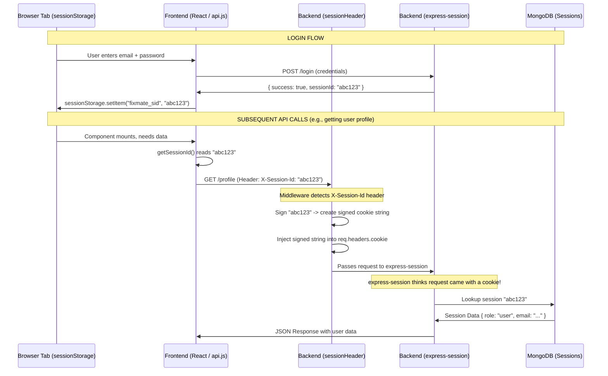

# FixMate Multi-Tab Auth Flow

This diagram explains how the new session header based authentication works across multiple tabs without conflicts.

## Why this approach?
- **Standard JWT** doesn't support easy invalidation (logout) without a blocklist.
- **Standard Cookies** are shared across all tabs in a browser. If you log in as Admin in Tab 1, and User in Tab 2, both tabs will use the User cookie and the Admin tab will break.
- **Session Header** combines the best of both:
  - Tab independence (via `sessionStorage`)
  - Full server-side session control and easy logout (via `express-session` & MongoDB)
  - No changes needed to existing `req.session` based route handlers structure!
