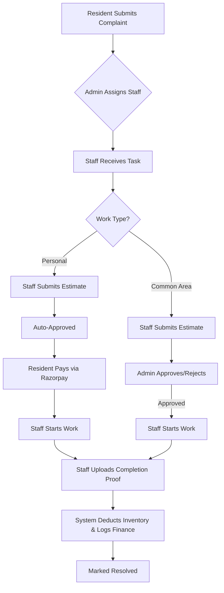

# FixMate 🏢 - Comprehensive System Documentation

FixMate is a high-end, full-stack residential society management platform designed to automate and streamline interactions between **Residents**, **Maintenance Staff**, and **Administrators**. It features a robust role-based architecture, real-time task polling, and a unique multi-tab session strategy.

---

## 🌟 1. System Architecture & Tech Stack

- **Frontend**: React.js, Tailwind CSS, React Router, Recharts (Analytics).
- **Backend**: Node.js, Express.js.
- **Database**: MongoDB (Mongoose ORM).
- **Authentication**: Custom Dual-Storage Session (Header-based `sessionStorage` + backend Cookies).
- **Communication**: 
  - **Nodemailer**: Automated email notifications for account credentials.
- **Third-Party Integrations**:
  - **Razorpay**: For maintenance and estimate payments.
  - **Cloudinary**: Secure image hosting for complaint/resolution proofs.

---

## 📁 2. Project Structure Overview

```text
FyProject/
├── app.js                 # Entry point, middleware setup, route registration
├── controller/            # Business logic
│   ├── admin.js           # Dashboard stats, Staff/User CRUD, Assigning tasks
│   ├── auth.js            # Authentication & Password management logic
│   ├── inventory.js       # Stock tracking & automated deductions
│   ├── payment.js         # Razorpay & Society expense management
│   ├── profile.js         # Profile management
│   ├── staff.js           # Staff-specific operations
│   └── user.js            # Complaint filing & Resident workflows
├── middleware/            # Auth guards & session header injection
├── model/                 # Mongoose Schemas (Auth, User, Staff, Complain, Payment, Inventory, Announcement, Finance)
├── routes/                # Express Routers
└── frontend/              # React SPA
    └── src/
        ├── Components/    # Modular UI (Admin/, Staff/, User/, UI/)
        ├── Context/       # AuthContext for role-based global state
        └── utils/         # API wrappers & Auth Header utilities
```

---

## 👥 3. Advanced Module Workflows

### 🛠️ The Dual-Path Complaint Lifecycle
Complaints follow different logic based on whether they are "Personal" or "Common Area":



### 🧑‍💻 Feature Breakdown

#### 1. Resident Module
- **Smart Dashboard**: View real-time status of all filed complaints.
- **Revocation**: Residents can revoke staff assignments for **Personal** work if it hasn't progressed to the "In Progress" stage.
- **Payment Portal**: Securely pay maintenance bills and repair estimates via **Razorpay**.

#### 2. Staff Module
- **Auto-Polling**: The dashboard polls every 15s to ensure instant task delivery.
- **Work Proofs**: Mandatory "After" photo upload via Cloudinary for resolution.
- **Inventory Reporting**: Staff can report materials used, triggering automated stock updates.

#### 3. Administrator Module
- **Live Analytics**: Real-time charts for revenue breakdown and complaint status (WIP/Pending).
- **Member Management**: Create and manage Residents/Staff; system auto-emails temp passwords.
- **Inventory Management**: Automated stock tracking with low-stock warnings.
- **Financial Audit**: Automatic logging of "Income" (Resident payments) and "Expense" (Staff payouts for Common Area repairs).

---

## 🔐 4. Multi-Tab Session Engine (Hybrid Auth)

To allow users to operate different roles (Admin/User/Staff) in different tabs simultaneously, FixMate implements a **Header-based Session Strategy**:

1. **Isolation**: `sessionId` is stored in `sessionStorage` (isolated per tab).
2. **Injection**: React injects `X-Session-Id` into every Axios/Fetch request header.
3. **Middleware**: `sessionHeader.js` intercepts this header and maps it to `req.session` before `express-session` processes it.
4. **Persistence**: `localStorage` acts as a backup for session recovery upon tab refreshes.

---

## 🗄️ 5. Database Schema Key Models

| Model | Purpose | Key Fields |
| :--- | :--- | :--- |
| **Auth** | Credentials | email, password (hashed), role, isFirstLogin |
| **Complain** | Task Tracking | status, workType, estimatedCost, actualCost, proofImage |
| **Finance** | Cashflow | transactionType, amount, relatedComplaint, handledBy |
| **Inventory** | Stock Control | name, quantity, minQuantity, unitPrice |
| **Announcement** | Communication | title, content, targetAudience (All/Residents/Staff) |

---

## 🛠️ 6. Setup & Developer Utilities

### Installation
```bash
npm install
cd frontend && npm install
```

### Environment Variables (.env)
```text
MONGO_URI=your_mongodb_uri
SESSION_SECRET=your_secret
PORT=3000
EMAIL_USER=admin_email
EMAIL_PASS=app_specific_password
RAZORPAY_KEY_ID=your_key
RAZORPAY_KEY_SECRET=your_secret
```

### Database Fixer Script
If state becomes inconsistent during testing, run:
```bash
node scripts/fixData.js
```
- Resets all passwords to `Temp@1234`.
- Syncs inventory counts.
- Wipes failed payment logs.

---

## 💳 7. Payment Testing (Razorpay)
Use the following UPI IDs in the checkout for testing:
- **Success**: `success@razorpay`
- **Failure**: `failure@razorpay`